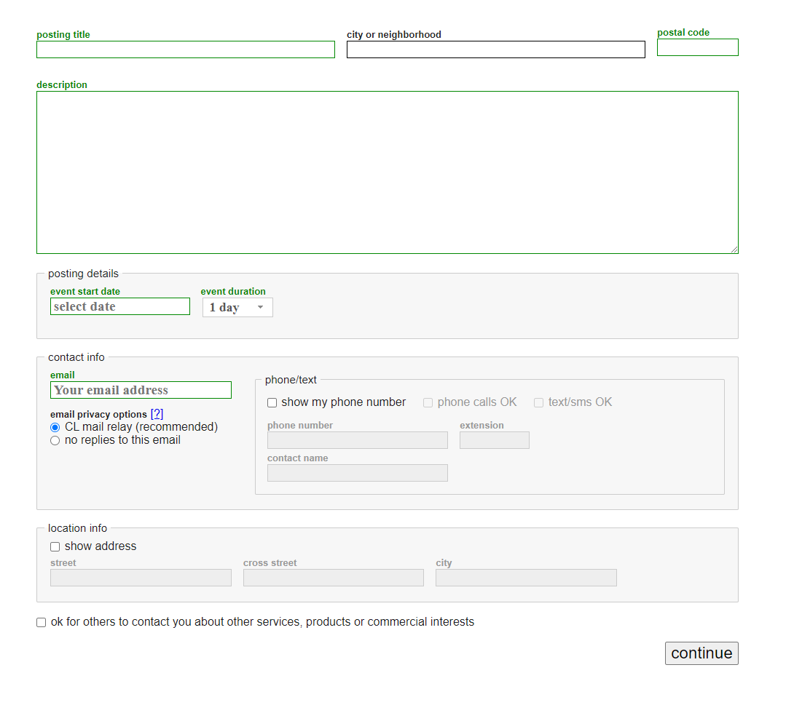
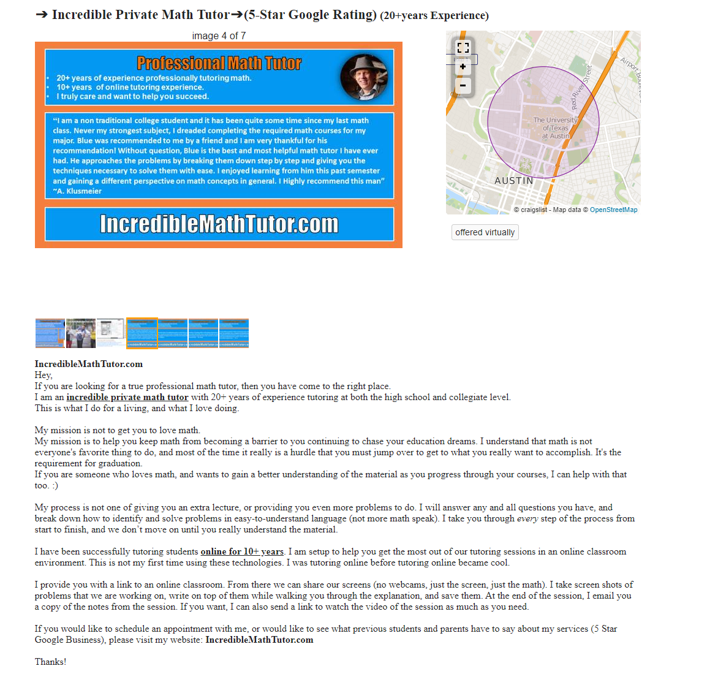

## Questions

- What's the topic of the JET session?
    - What will the topics of the JET sessions be?
        - For example, math is probably my strongest subject, so JET sessions that deal with math is significantly easier than say, a JET session involving Russian.
- If I'm getting a bunch of kids, how am I going to deal with that?
    - How do I engage with people I've never met
    - How do I "teach" them the methodology for JET sessions?
    - How do I get them to trust me?
    - How do I get them to teach each other?
    - How do I deal with different personalities
    - How do I deal with parents?
    - How do I run a JET session?
    - What happens if people don't like it?
- How do I advertise JET sessions?
    - What's the marketing say?
    - What do I tell people the results are?
    - Do I need to tell people my credentials?
- Where do I advertise JET sessions?
- What happens if the JET session doesn't work?
- What resources can I use?

## Notes

## Craigslist post

- [ ] Craigslist post
- Post is for the parents
- List what's special about my tutoring
    - Homeschooled
    - Teaching your student how to learn

Fill in those blocks.

### Examples

https://austin.craigslist.org/lss/d/austin-incredible-private-math-tutor5/7368054310.html

