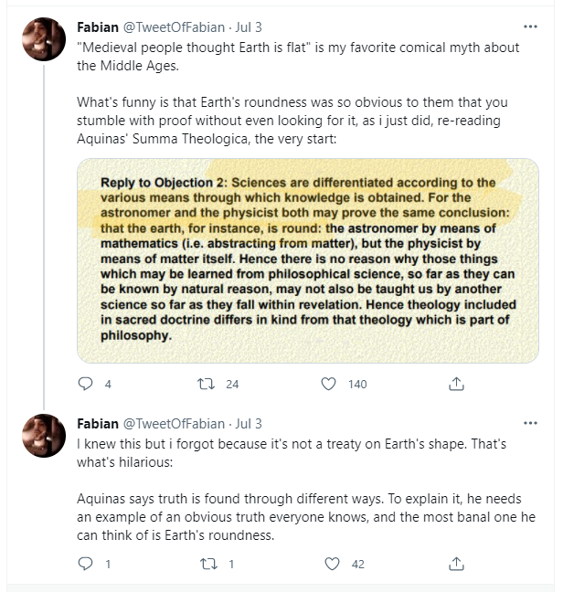

https://twitter.com/TweetOfFabian/status/1411341618406363140?s=20

It is a myth that people believe the earth was flat in medieval times. It's true that the majority of people believed the earth was flat, but that's not because they'd read that, it's because they didn't *anything* the majority of the population was illiterate and dumb, so they don't really count.

The tweet basically says that in Aquinas' Summa Theologica, Aquinas' most well known work, intended to be an instructional guide for theology students, Aquinas tries to say that truth is found through different ways. To explain it, he needs an example of an obvious truth that everyone knows, and the one he uses is that the Earth is flat.

So then, the question is, when did different societies believe the Earth was flat?